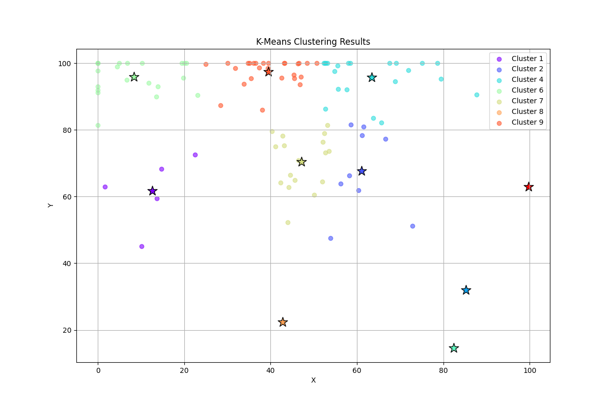

# K-Means Clustering Implementation

This implementation of the K-Means clustering algorithm includes:
- Euclidean distance-based clustering
- Gaussian distribution-based data generation
- Cluster quality assessment using silhouette scores
- Visual output generation using matplotlib
- Detailed cluster statistics

## Requirements
- Python 3.6+
- numpy
- matplotlib

## Usage
1. Install requirements:
```bash
pip install numpy matplotlib
```

2. Run the program:
```bash
python k-means.py
```

The program will:
- Generate random data points using Gaussian distributions
- Perform k-means clustering
- Save the visualization to output/clustering_result.png
- Display cluster statistics in the console

## Results

The program generates a visualization showing:
- Points colored by their cluster assignment
- Centroid positions marked with stars
- Grid lines for better readability
- Legend identifying each cluster

The console output shows:
- Number of iterations to convergence
- Statistics for each cluster:
  - Centroid coordinates
  - Number of points
  - Silhouette score (cluster quality measure)

# Here are the results of my Lab Task:

  
*Figure 1: K-Means Clustering Results*

The visualization shows how the algorithm successfully groups similar points into clusters, with each cluster represented by a different color. The centroids (marked with stars) represent the center of each cluster.

  
*Figure 2: Program Output.*

  
*Figure 3: 2D Visualization.*

  
*Figure 4: Generated Points.*


