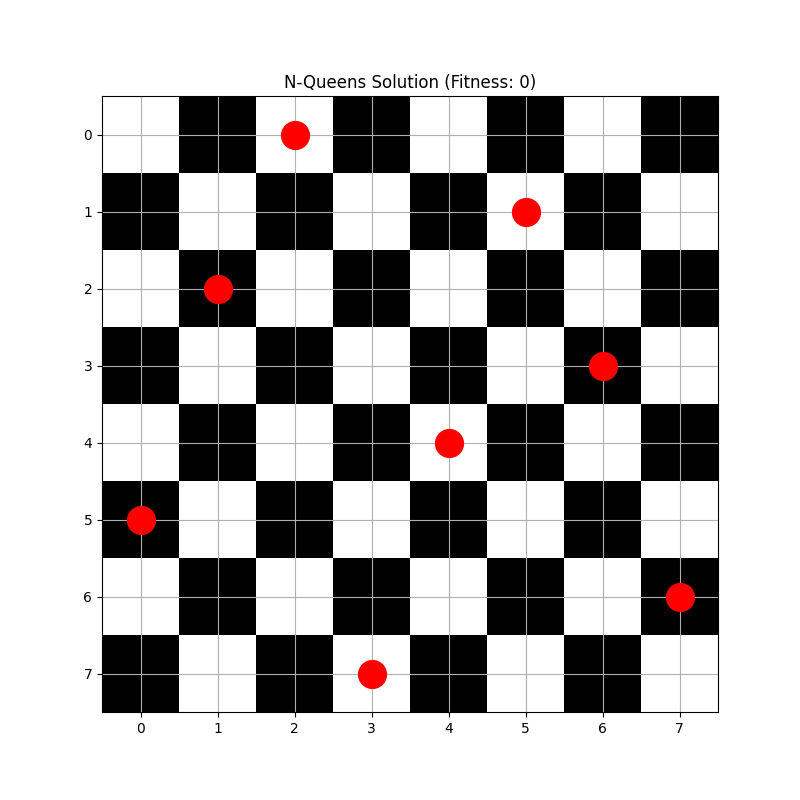
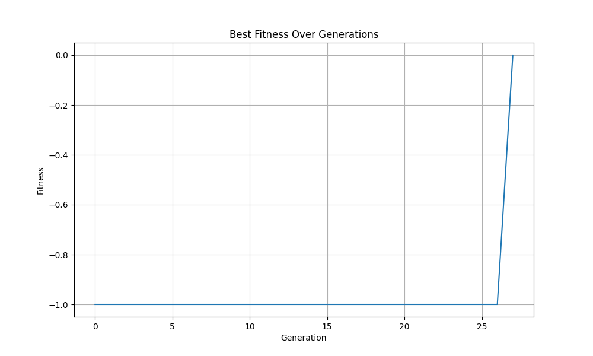

# N-Queens Genetic Algorithm Implementation

This implementation of the N-Queens problem using genetic algorithms includes:
- Tournament selection for parent selection
- Order crossover operator for genetic recombination
- Elitism to preserve best solutions
- Visual solution representation
- Fitness history tracking
- Configurable parameters

## Requirements
- Python 3.6+
- numpy
- matplotlib

## Usage
1. Install requirements:
```bash
pip install numpy matplotlib
```

2. Run the program:
```bash
python genetic.py
```

The program will:
- Solve the N-Queens problem using genetic algorithms
- Display the solution visually
- Show the fitness progression over generations
- Save visualizations to the output directory

## Results

The program generates two visualizations:
1. Chess Board Solution:
   - Shows the final arrangement of queens
   - Chess board pattern for better visualization
   - Queens marked with red circles
   - Grid lines and coordinates

2. Fitness History:
   - Shows how the solution quality improved over generations
   - X-axis: Generation number
   - Y-axis: Fitness score (negative number of conflicts)
   - Grid lines for better readability

The console output shows:
- Generation number when solution was found
- Final fitness score (0 means no conflicts)

# Here are the results of my Lab Task:

  
*Figure 1: 8-Queens Solution Board*

  
*Figure 2: Fitness Progression Over Generations*

The solution shows a valid arrangement of 8 queens on the chess board where no queen can attack another queen. The fitness history plot demonstrates how the genetic algorithm improved the solution over generations until finding a valid arrangement.


